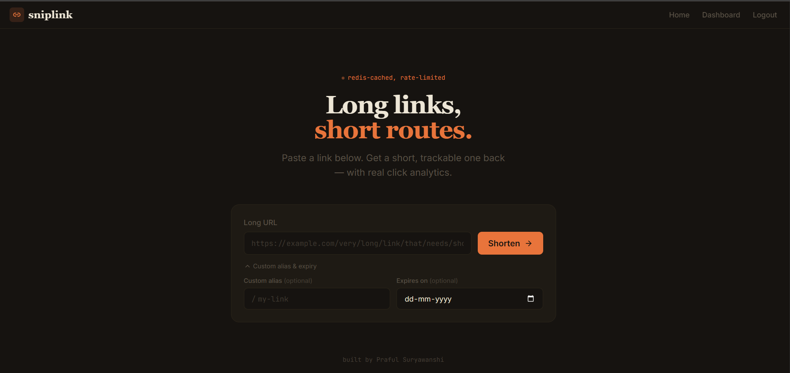
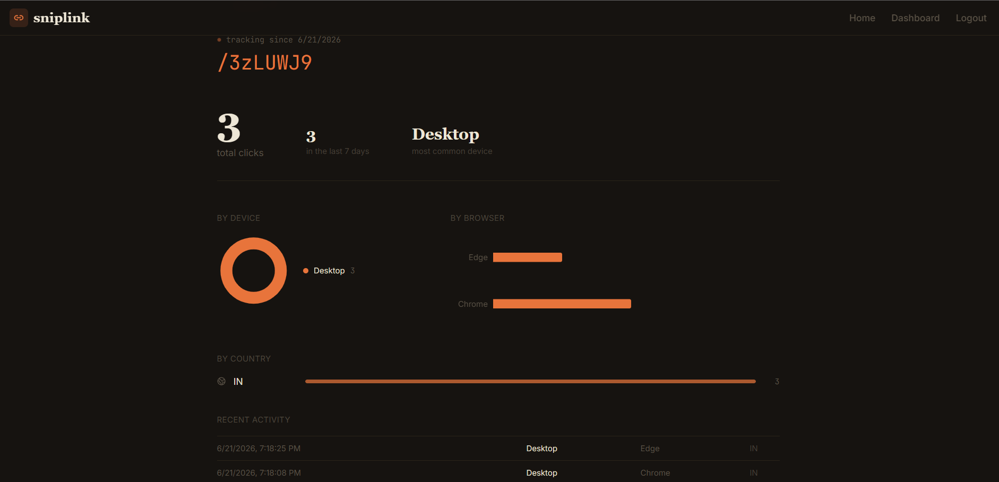
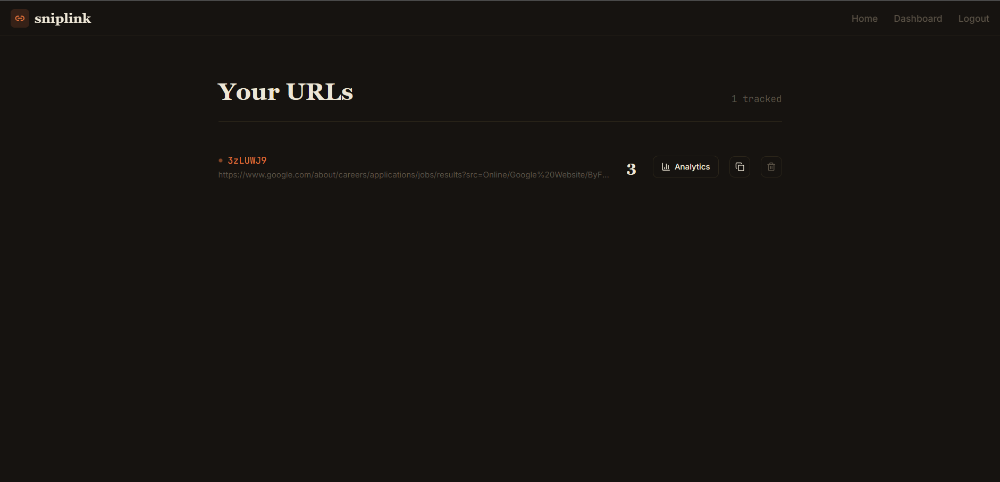
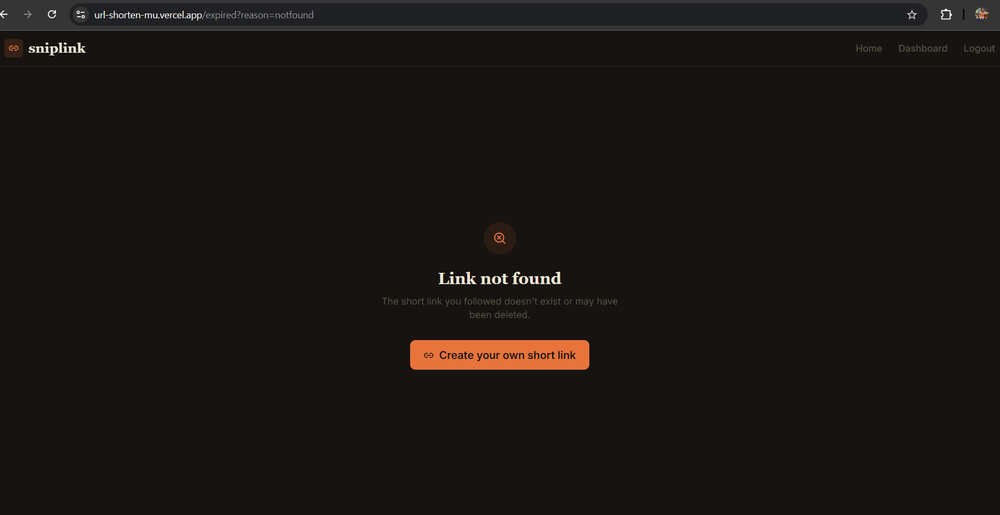

# Sniplink

A production-grade URL shortener with Redis-backed rate limiting, real-time click analytics, custom aliases, and link expiry — built to behave like a real product, not a tutorial clone.

**Live app:** [sniplink.is-a.dev](https://sniplink.is-a.dev) *(custom domain pending DNS propagation — temporary link: [url-shorten-mu.vercel.app](https://url-shorten-mu.vercel.app))*



---

## Why This Exists

Most URL shortener tutorials stop at "generate a random string, save to DB, redirect." Sniplink goes further — it's built around the same problems real shorteners (Bitly, TinyURL) actually have to solve: abuse prevention, cache invalidation, distributed rate limiting, and per-link analytics.

Every feature here was added because it maps to something concrete: rate limiting because public APIs get abused, Redis caching because hitting MongoDB on every redirect doesn't scale, cache invalidation because deleting a link shouldn't leave it reachable for 24 more hours.

---

## Features

- **JWT Authentication** — signup/login, URL creation is gated behind auth
- **Redis Rate Limiting** — 10 requests/minute per user using the INCR + TTL pattern, fails open if Redis is unreachable
- **Custom Aliases** — pick your own short code, with conflict detection
- **Link Expiry** — set an expiration date; expired links route to a proper expired-link page instead of erroring
- **Redis-Cached Redirects** — first visit hits MongoDB and populates the cache; subsequent visits are served from Redis with a 24-hour TTL
- **Cache Invalidation on Delete** — deleting a URL also clears its Redis key, so it doesn't keep resolving from a stale cache
- **Click Analytics** — every redirect logs IP, country, city, device type, browser, and OS (via `geoip-lite` and `ua-parser-js`), without blocking the redirect itself
- **Analytics Dashboard** — per-link breakdown by device, browser, and country, plus a recent-activity feed



---

## Tech Stack

**Backend:** Node.js, Express, MongoDB (Mongoose), Redis (ioredis, hosted on Upstash), JWT
**Frontend:** React 19, React Router, Tailwind CSS v4, Recharts
**Deployment:** Railway (backend), Vercel (frontend)

---

## Architecture Notes

A few decisions worth calling out, since they came from actual bugs hit during development rather than upfront design:

**Rate limiting uses Redis, not an in-memory counter.** An in-memory counter resets on every server restart and doesn't work across multiple server instances — Redis lives outside the app process, so it survives both.

**`maxRetriesPerRequest` is set to `null`, not a fixed retry count.** Initial config used `maxRetriesPerRequest: 3` with a retry strategy that gave up after 3 attempts. This worked locally but broke in production — Railway's network occasionally drops the Redis connection, and a capped retry strategy meant the app stopped reconnecting permanently after one bad network blip. Switched to an uncapped retry strategy with exponential backoff so transient drops self-heal instead of killing the connection.

**Delete operations explicitly clear the Redis cache.** Initially, deleting a URL only removed it from MongoDB — the Redis-cached version (with up to 24h TTL) kept serving redirects for a deleted link. Fixed by clearing the corresponding Redis key inside the same delete operation.

**Click logging never blocks the redirect.** `logClickEvent()` is fired without `await` and wrapped in its own try/catch — if geo lookup or the database write fails, the user still gets redirected immediately. Analytics is secondary to the core feature working.

---

## Project Structure

```
BACKEND/
├── src/
│   ├── config/        # MongoDB + Redis connection setup
│   ├── controller/     # Route handlers
│   ├── dao/            # Database queries
│   ├── services/       # Business logic (URL creation, click logging, analytics aggregation)
│   ├── middleware/      # Auth, rate limiting
│   ├── models/          # Mongoose schemas
│   ├── routes/
│   └── utils/           # Error handling, JWT helpers
└── app.js

FRONTEND/
├── src/
│   ├── api/             # API client functions
│   ├── components/      # Navbar
│   ├── pages/           # Login, Register, Dashboard, Analytics, Expired
│   ├── routing/
│   └── App.jsx           # Homepage / shorten form
```

---

## Running Locally

**Backend**
```bash
cd BACKEND
npm install
# create a .env file — see Environment Variables below
node app.js
```

**Frontend**
```bash
cd FRONTEND
npm install
# create a .env file with VITE_API_URL and VITE_APP_URL pointing to your local backend
npm run dev
```

### Environment Variables

**Backend `.env`**
```
MONGO_URI=
JWT_SECRET=
REDIS_URL=
FRONTEND_URL=
APP_URL=
ALLOWED_ORIGINS=
PORT=3000
```

**Frontend `.env`**
```
VITE_API_URL=
VITE_APP_URL=
```

---

## Screenshots

| Homepage | Dashboard |
|---|---|
|  |  |

| Analytics | Expired Link |
|---|---|
|  |  |

---

## Built By

Praful Suryawanshi